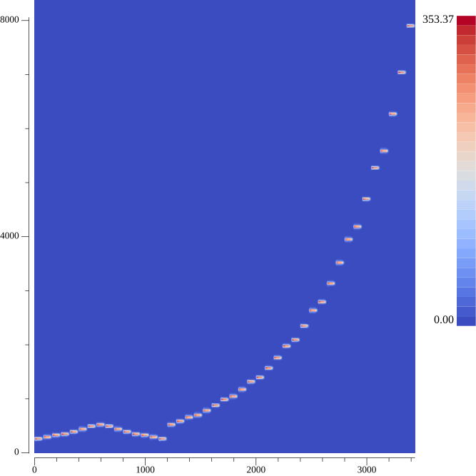
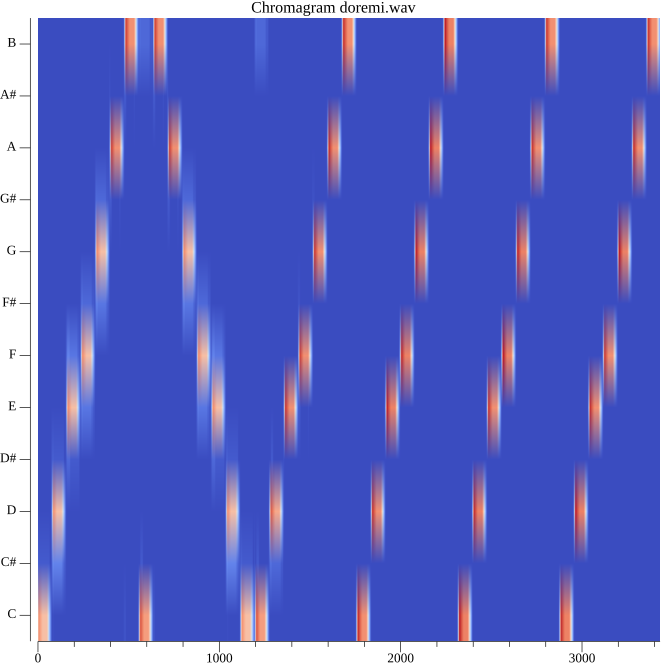

musiclab

Learning audio

### Build
```
go build
```

### Generate music scale
```
./musiclab doremi
```

File doremi.wav created

### Play audio file
```
./musiclab play --file=doremi.wav
```

### Spectrogram

Create audio file spectrogram
```
./musiclab spectrogram --file=doremi.wav
```


### Chromagram
Create audio file chromagram
```
 ./musiclab chromagram --file=doremi.wav
 ```
